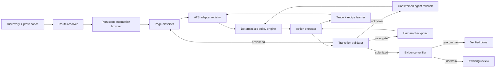

# JAT v11 Auto-Apply Reliability and External ATS Master Plan

**Status:** architecture and implementation plan only  
**Date:** 2026-06-19  
**Scope:** LinkedIn Easy Apply, external company sites, hosted ATS applications,
human intervention, teaching, healing, evidence, testing, and rollout  
**Runtime code changed by this document:** none

## 1. Executive decision

JAT should stop treating every application as a page containing vaguely named
`Apply`, `Next`, and `Submit` buttons. That model supplied useful prototypes,
but it cannot safely reach a 70% verified submission rate across external ATS
sites. The June 19 control run demonstrated that the same generic scan can:

- click a LinkedIn opener repeatedly while an unrecognized resume-choice
  interstitial is open;
- mistake a newsletter or problem-report `Submit` button for an application;
- mistake static success-like text for a new confirmation;
- call invisible CAPTCHA integrations visible user blockers;
- call a real Indeed Cloudflare verification page a hydration or occlusion
  failure;
- lose the actionable external URL and send the user back to the source board;
- overwrite the original job identity after a broken redirect reaches a search
  page.

The proposed architecture is a **hybrid deterministic workflow engine**:

1. The desktop app owns a persistent Playwright automation browser and the
   durable workflow state.
2. Every page must be classified into a typed application state before an
   action is allowed.
3. High-volume ATS families receive deterministic adapters with explicit
   invariants and success proofs.
4. A constrained AI fallback may propose actions on unknown sites, but the
   deterministic policy layer validates and executes them.
5. Human teaching produces typed, testable recipes rather than unstructured
   advice.
6. `done` is impossible without new, post-submit evidence tied to a grounded
   application form.

This is not a promise that every website can be submitted without intervention.
CAPTCHAs, identity verification, closed postings, broken employer links, legal
consent, account recovery, and website policy can require the user. The hard
guarantees should instead be:

- **100% honest terminal states:** zero known false submissions.
- **100% actionable intervention records:** every `needs you` item opens the
  exact live checkpoint and explains the required action.
- **At least 70% verified autonomous completion** across *eligible, reachable,
  supported application attempts* in a representative rolling test corpus.
- A separate, unhidden raw end-to-end rate across every dispatched job, so the
  denominator cannot be manipulated by excluding difficult sites.

## 2. Evidence baseline

### 2.1 June 19 v11.23.x control run

The app was upgraded to v11.23.1 and started at approximately 09:12 local.
Keep-awake was enabled at 09:14, so this run was not primarily a screen-off or
Windows-sleep failure.

The new discovery system worked:

| Provider query | Found | Accepted | Notes |
|---|---:|---:|---|
| LinkedIn / remote | 25 | 22 | 3 duplicates |
| Indeed / remote | 19 | 6 | 13 filtered |
| LinkedIn / Ontario | 25 | 18 | 5 duplicates, 2 rejected |
| Indeed / Ontario | 25 | 15 | 10 rejected |
| LinkedIn / Toronto | 25 | 15 | 6 duplicates, 4 rejected |
| Indeed / Toronto | 25 | 2 | 12 duplicates, 11 rejected |

The run created 78 new tasks:

| State | Count |
|---|---:|
| Failed | 60 |
| Awaiting input | 5 |
| Skipped | 4 |
| Queued when inspected | 7 |
| Reported done | 2 |

The dashboard's roughly 115 failures were not 115 newly created tasks. It mixed
new attempts, retried/updated history, and 12 older dead wait records reclaimed
at app startup. Session identity must be added to all future metrics.

### 2.2 Dominant failure fingerprints

Across the recent window, the largest labels were:

| Recorded label | Count | What the evidence actually showed |
|---|---:|---|
| Easy-Apply form did not hydrate | 32 | Mixed LinkedIn interstitials, external landing pages, ATS list pages, and real forms the generic detector did not understand |
| Window occluded / LinkedIn throttled | 22 | Twenty were Indeed Cloudflare `Additional Verification Required` pages, not LinkedIn or occlusion |
| Repeated `Easy Apply to this job` | 22 | LinkedIn opened an intermediate application/resume choice that was not recognized; the underlying opener remained discoverable |
| Generic could not complete | 12 | Older invalid wait records reclaimed at startup without useful diagnostics |
| Site sign-in required | 9 | Mostly Glassdoor; generally a real but non-resumable gate |
| No advance button | 6 | Often a real external form or landing page whose control did not match the broad keyword list |
| CAPTCHA needs you | 5 | Mostly invisible CAPTCHA iframes or misclassification; two jobs were broken redirects back to LinkedIn search |
| External opener could not be opened | 5 | Route transition or target ownership was not established |
| Maximum steps | 4 | The engine had no typed state transition and exhausted a generic loop |

### 2.3 The two reported submissions were not trustworthy

Neither June 19 `done` record was LinkedIn Easy Apply.

1. **Activision:** the child executor arrived on a public careers page containing
   a search field, an email-alert field, `Apply Now`, and generic `Submit`. It
   selected `Submit` without opening or filling a grounded application form and
   claimed confirmation about 176 ms later. Static recruitment text likely
   satisfied the page-wide success matcher.
2. **Canada Job Bank:** the page exposed job search controls, a problem-report
   form, `Direct Apply`, `Show how to apply`, and generic `Submit`. JAT reported
   done without opening or filling an application form.

Both must be treated as **false-positive submissions unless independently
verified**. This establishes the release-zero requirement: success truth must be
fixed before throughput work.

### 2.4 External host evidence from historical flight records

The existing corpus already identifies the adapter order:

| ATS/host family | Observed handoffs | Verified done | Dominant result |
|---|---:|---:|---|
| Lever | 6 | 0 | generic failure / false CAPTCHA |
| Ashby | 4 | 0 | hydration failure / false CAPTCHA |
| Workday company hosts | at least 5 | 0 | max steps, port closure, empty diagnostics |
| Accenture career flow | 4 | 0 | hydration or opener failure |
| Amazon Jobs | 3 | 0 | no advance control found |
| Greenhouse | 2 | 0 | generic failure |
| Ford/Oracle Recruiting flow | 2 | 0 | repeated `Next` without state transfer |
| iCIMS, Taleo, Oracle HCM, UltiPro, BambooHR, Avature, Rippling | multiple singletons | 0 | generic detector failures |

Discovery has therefore moved the bottleneck exactly where expected: route and
form execution.

## 3. Historical lessons that must remain preserved

The plan must not regress fixes already earned through earlier long runs:

1. **Queue starvation:** discovery now cycles query/location/board combinations
   and no longer runs out of work.
2. **Worker leakage:** owned windows and tabs are persisted and reconciled after
   MV3 service-worker eviction.
3. **Separate-site scheduling:** parallel workers must use distinct board/ATS
   keys and never hammer one host concurrently.
4. **External ownership:** source and child tabs require explicit ownership and
   child result adoption.
5. **Sticky LinkedIn modal scope:** a fieldless resume/review step still belongs
   to the Easy Apply modal.
6. **Duplicate action breaker:** repeating the same opener indefinitely is
   forbidden.
7. **Control Studio:** the user can watch, pause, step, correct, retry, and teach.
8. **Flight records:** robot-visible text, fields, buttons, URL, and actions are
   durable diagnostics.
9. **Typed failure policy:** transient loading, missing information, site gates,
   unmanaged sites, and relevance skips have different outcomes.
10. **App-owned discovery:** JobSpy is the primary provider; browser discovery is
    a typed fallback.

These are foundations, not the final execution architecture.

## 4. Success definition and service-level objectives

### 4.1 Funnel definitions

Every job must move through an explicit funnel:

1. `discovered`
2. `accepted_by_filters`
3. `source_page_verified`
4. `route_resolved`
5. `application_surface_grounded`
6. `eligible_and_reachable`
7. `fields_complete`
8. `submit_authorized`
9. `submit_attempted`
10. `submission_verified`

Each transition records a timestamp, owner, URL, ATS family, evidence, and
failure code. No aggregate should infer a stage from a vague final error.

### 4.2 Primary metrics

| Metric | Release target |
|---|---:|
| Verified submissions / eligible reachable supported attempts | >= 70% over 200 attempts |
| Verified submissions on mature adapters | >= 80% over 30 attempts per adapter |
| False `done` rate | 0 in test; < 0.1% in production with all cases audited |
| Repeated identical page action | 0 after the first no-progress retry |
| `needs you` with exact resumable checkpoint | 100% |
| `failed` with typed cause, evidence, and next action | >= 99% |
| External target captured and canonicalized | >= 98% |
| Resume upload when required | >= 95% on supported adapters |
| Known question answer accuracy | >= 98% for deterministic/profile answers |
| Unknown question surfaced to user | 100%; never fabricated |
| Resume after human action | <= 5 seconds after user presses Continue |

### 4.3 Honest denominators

Report all of these side by side:

- **Raw dispatch success:** verified submissions / every dispatched task.
- **Reachable success:** verified submissions / jobs whose source link reached a
  valid application.
- **Supported automation success:** verified submissions / jobs handled by a
  mature adapter without a mandatory user gate.
- **Assisted success:** verified submissions after one or more human checkpoints.
- **Coverage:** supported attempts / reachable attempts.

The 70% goal applies to supported, eligible, reachable attempts. Raw success is
the product truth and must never be hidden.

## 5. Target architecture



### 5.1 Desktop-owned Playwright worker

The main architectural change is moving execution ownership out of ephemeral MV3
content-script loops into a durable app-side worker.

Proposed runtime:

- Add a Node worker process under `app/src/automation/` using Playwright.
- Launch one dedicated persistent Chrome/Chromium profile under
  `%APPDATA%/jat11-app/automation-profile`.
- The user signs into LinkedIn/Indeed/ATS SSO once in that profile. Cookies,
  IndexedDB, and trusted-device state survive restarts.
- Maintain one browser process and a bounded tab pool. Do not create a new Chrome
  window per task.
- The app process owns task leases, checkpoints, traces, retries, and shutdown.
- The extension remains useful for manual capture, source-page UI, Control Studio
  entry, and migration fallback, but it is no longer the only executor.
- During migration, `executorEngine` supports `extension`, `playwright-shadow`,
  and `playwright` modes.

Why Playwright:

- locators re-resolve after DOM rerenders;
- actionability checks wait for visible, stable, enabled, event-receiving
  controls;
- frame, popup, download, file-upload, dialog, and network events are first-class;
- browser contexts and persistent state are explicit;
- tracing captures DOM snapshots, screenshots, actions, console, and network;
- it is Apache-2.0 and TypeScript-native, matching the app better than a second
  Python RPA runtime.

The Playwright worker must not attach to Pierre's normal Chrome profile. A
dedicated automation profile avoids profile locks, accidental control of personal
tabs, and remote-debugging exposure to unrelated processes.

### 5.2 Durable workflow state machine

Replace the current generic step loop with explicit states:

```text
SOURCE_JOB
  -> SOURCE_APPLY_READY
  -> ROUTE_TRANSITION
  -> EXTERNAL_LANDING | LINKEDIN_INTERSTITIAL | APPLICATION_FORM
  -> ACCOUNT_CHOICE | LOGIN | CONSENT | APPLICATION_FORM
  -> FORM_STEP
  -> REVIEW_STEP
  -> SUBMIT_READY
  -> SUBMITTING
  -> CONFIRMATION | UNCERTAIN_SUBMIT | USER_GATE | FAILED_TYPED
```

Every state has:

- entry predicates;
- allowed actions;
- expected transitions;
- timeout policy;
- retry alternatives;
- user-intervention policy;
- evidence captured before and after action.

Actions are typed, not text labels:

```text
OPEN_APPLICATION
SELECT_APPLICATION_VARIANT
ACCEPT_CONSENT
SIGN_IN
CREATE_ACCOUNT_WITH_APPROVAL
FILL_FIELD
SELECT_OPTION
UPLOAD_RESUME
ADVANCE_FORM
OPEN_REVIEW
SUBMIT_APPLICATION
RESOLVE_VISIBLE_GATE
WAIT_FOR_NETWORK
```

The policy layer forbids actions that are invalid for the current state. A
generic `Submit` is never `SUBMIT_APPLICATION` merely because of its text.

### 5.3 Application surface grounding

Before filling or advancing, produce an `ApplicationSurface`:

```json
{
  "ats": "lever",
  "root": "stable locator or frame path",
  "jobIdentity": { "title": "...", "company": "...", "externalId": "..." },
  "signals": ["resume field", "candidate email", "application heading"],
  "fields": [],
  "actions": [],
  "confidence": 0.98,
  "scopeHash": "..."
}
```

Grounding requirements:

- The container is visible and belongs to the current job.
- It contains candidate/application semantics, not search, newsletter, contact,
  cookie, or problem-report semantics.
- The title/company/job ID agree with the source identity when available.
- The root is a form, modal, frame, or application SPA region with stable
  ownership.
- Candidate controls are classified by purpose.

No global-document fallback is allowed for `Next`, `Review`, or `Submit` after
application execution begins.

### 5.4 Route chain and job identity

Add a durable `application_routes` chain instead of overwriting `jobs.job_url`:

```text
source LinkedIn URL
 -> employer careers detail URL
 -> ATS job detail URL
 -> ATS application URL
 -> confirmation URL
```

Each hop stores:

- source and destination URL;
- origin and ATS family;
- navigation type: same-tab, popup, redirect, script-open, form POST;
- timestamp and browser page ID;
- title/company/job ID observed at destination;
- validity: matching, ambiguous, broken, unrelated search, closed;
- screenshot and accessibility snapshot reference.

Rules:

- Child navigation can never rewrite the canonical source job title/company.
- A redirect to a search page is `BROKEN_EXTERNAL_LINK`, not CAPTCHA.
- If the external page identifies a different job, stop and ask before applying.
- Prefer canonical direct apply URLs from trusted ATS metadata when available.
- Store the last actionable URL separately from source and job-detail URLs.

## 6. Adapter architecture

### 6.1 Adapter contract

Each adapter implements the same contract:

```text
detect(page) -> confidence + ATS family
identifyJob(page) -> title/company/externalId/status
classifyState(page) -> typed workflow state
locateApplicationSurface(page) -> grounded surface
listFields(surface) -> normalized field descriptors
fillField(field, answer) -> action result
uploadResume(field, document) -> attachment evidence
chooseInterstitial(state, policy) -> action result
advance(state) -> expected transition
prepareSubmit(state) -> submit candidate + preconditions
submit(candidate) -> network/action evidence
verifySubmission(before, after) -> evidence verdict
detectGate(page) -> typed gate
checkpoint(page) -> resumable state
```

Adapters use locator tiers:

1. role/name/label and ATS-owned test IDs;
2. stable semantic attributes;
3. adapter-specific CSS;
4. learned recipe locator with version/confidence;
5. AI proposal, validated against the adapter contract.

### 6.2 Priority 0: universal correctness layer

Build before any site adapter:

- application/non-application form classifier;
- field ownership and purpose classifier;
- pre/post action snapshots;
- no-progress detection based on state, not DOM byte count;
- visible gate detector;
- route-chain persistence;
- success evidence quorum;
- exact human checkpoint persistence;
- domain/ATS normalization.

### 6.3 Priority 1: LinkedIn Easy Apply

Easy Apply remains important and should become a real adapter rather than a
special collection of generic selectors.

Required states:

- job detail with Easy Apply opener;
- resume/application choice interstitial;
- contact information;
- resume selection/upload;
- additional questions;
- work authorization;
- voluntary EEO section;
- review;
- final submit;
- confirmation;
- daily limit;
- already applied;
- verification/login gate.

Resume-choice behavior:

- Recognize `use previous application/resume`, `start a new application`, and
  account/application-choice variants as their own modal state.
- Apply a user-configured policy, e.g. prefer current selected resume; begin a
  new application when the previous resume differs; otherwise ask once and
  remember the choice.
- Once an interstitial owns the flow, hide the underlying opener from the action
  candidate set.
- Require a new modal/state signature before another opener click can occur.

### 6.4 Priority 2: Lever

Lever is the largest observed external family and has stable hosted application
URLs.

- Resolve `jobs.lever.co/{site}/{postingId}` to `/apply` directly.
- Use the public Postings API for posting identity and `applyUrl` validation.
- Do **not** call the application POST API: it requires an employer API key.
- Support name/contact, resume, links, free text, custom questions, consent, and
  location.
- Distinguish invisible reCAPTCHA integration from a visible blocking challenge.
- Verify success from a new confirmation state or application receipt, never
  from pre-existing page text.

### 6.5 Priority 3: Ashby

- Canonicalize board query URLs to the specific posting/application route.
- Handle the application SPA, dynamic questions, comboboxes, file upload,
  demographic sections, and validation summaries.
- Use Ashby's public job posting API for identity/liveness where possible.
- Detect embedded/invisible anti-bot widgets without treating them as blockers.
- Preserve the exact application route for human continuation.

### 6.6 Priority 4: Greenhouse

- Recognize hosted and embedded Greenhouse boards/iframes.
- Use the public Job Board API for job identity, liveness, and exposed question
  metadata where available.
- Do not use Greenhouse's application POST endpoint because it requires the
  employer's private Job Board API key.
- Support custom questions, education/employment blocks, attachments, consent,
  and inline validation.
- Ground submit inside the Greenhouse application form only.

### 6.7 Priority 5: Workday

Workday needs a dedicated SPA adapter and should not be attempted through broad
DOM heuristics.

- Normalize all company-specific `wdN.myworkdayjobs.com` domains to Workday.
- Handle job detail -> apply -> previous worker/account choice -> sign-in/create
  account/guest flow -> multi-page application.
- Track Workday route tokens and step headings instead of DOM size.
- Support custom comboboxes, address, experience, education, resume parsing,
  voluntary disclosures, and review.
- Preserve account/session state in the automation profile.
- Pause for email verification or account consent with an exact checkpoint.

### 6.8 Priority 6: major long-tail adapters

Implement based on observed volume and fixture availability:

1. Oracle Recruiting / Taleo / Ford apply flow
2. iCIMS
3. SmartRecruiters
4. BambooHR
5. SuccessFactors
6. UltiPro / UKG
7. Jobvite
8. Avature
9. Rippling
10. Phenom-hosted company career sites

### 6.9 Generic adapter

The generic adapter is last, not first. It may operate only when:

- an application surface is grounded above threshold;
- every proposed action is inside that surface;
- fields have semantic labels;
- no account, legal consent, or gate ambiguity exists;
- submit stays disabled unless the submit-proof preconditions pass.

Unknown sites default to assisted mode until a successful trace is converted to
a trusted recipe.

## 7. Barrier handling

### 7.1 CAPTCHA and anti-bot challenges

JAT must not attempt to bypass CAPTCHAs or evade site security. It should handle
them accurately and ergonomically.

Classification:

- `INVISIBLE_ANTIBOT_PRESENT`: hidden iframe/script only; continue normally.
- `VISIBLE_CAPTCHA`: challenge is visible and blocks the application; pause.
- `CLOUDFLARE_CHALLENGE`: verification page, Ray ID, or challenge flow; pause and
  foreground exact page.
- `RATE_LIMITED`: 429 or explicit limit; cool down host.
- `ACCESS_DENIED`: hard block; circuit-break host and inspect.

For a visible gate:

1. Keep the exact browser page alive.
2. Create a checkpoint with screenshot, URL, gate type, and instructions.
3. Notify the user and expose `Open live checkpoint`.
4. Detect when the challenge disappears.
5. Resume automatically from the next classified state.

Do not create a generic question and close the useful child tab.

### 7.2 Indeed Cloudflare behavior

The control run repeatedly saw `Additional Verification Required` and a Ray ID.
That is a real site challenge, not hidden-tab throttling.

- Extend challenge signatures to the exact observed copy and Cloudflare
  structure.
- Stop dispatching more Indeed work once the first challenge appears.
- Keep one foreground challenge page for the user.
- After the user passes it, validate session recovery with one canary job before
  reopening the host queue.
- If challenges recur, apply an exponential host cooldown rather than generating
  dozens of identical failures.

### 7.3 Login, SSO, account creation, OTP, and MFA

Typed outcomes:

- existing authenticated session;
- guest apply available;
- SSO available;
- account creation required;
- email verification required;
- OTP/MFA required;
- password reset required;
- access impossible.

Rules:

- Account creation and acceptance of terms require explicit stored user policy
  or per-event approval.
- Credentials belong in Electron `safeStorage`, not recipes or transcripts.
- Gmail integration may retrieve a job-site OTP only with explicit permission,
  sender/domain matching, expiry checks, and a visible audit event.
- TOTP may be supported only from a user-provided secret stored securely.
- Never disable or weaken MFA.
- Preserve authenticated ATS sessions in the dedicated automation profile.

### 7.4 Cookie and consent dialogs

Cookie dialogs are page chrome, not application state. Add a consent-policy
handler before adapter classification:

- accept necessary/default consent according to user policy;
- never opt into marketing automatically;
- record the choice;
- ensure the consent dialog does not become the detected application form.

### 7.5 Broken and misleading links

The GSOBA examples redirected from a job to an unrelated LinkedIn worldwide
search with a different `currentJobId`.

- Compare source and destination job identity.
- Classify unrelated search/feed/home/login destinations before running an
  executor.
- Quarantine the listing as `BROKEN_EXTERNAL_LINK`.
- Preserve both source and destination for inspection.
- Never mutate the canonical job record from the unrelated destination.

## 8. Submission truth and evidence

### 8.1 Submit preconditions

`SUBMIT_APPLICATION` is allowed only when all conditions hold:

- a grounded application surface exists;
- the candidate button is inside that surface;
- the surface job identity matches the task;
- required fields pass adapter validation;
- required resume attachment is verified;
- unanswered legal/eligibility questions are resolved;
- the button's semantic role is final submit, not newsletter, search, report,
  contact, save, or intermediate continue;
- the user/policy authorizes automatic submission for the current mode.

### 8.2 Baseline-before-submit

Immediately before clicking, record:

- URL and route state;
- application root signature;
- visible confirmation phrases already present;
- submit locator and surrounding form labels;
- field completion summary;
- resume filename/hash;
- screenshot and accessibility snapshot;
- relevant network request baseline.

Pre-existing success-like text cannot count after the click.

### 8.3 Evidence quorum

Strong evidence includes:

- a **new** confirmation container with ATS-specific success text;
- a transition to an ATS confirmation route;
- a successful application POST/XHR correlated with the submit action;
- an application/receipt ID;
- the grounded application form closing and a new confirmation surface opening;
- an ATS `already applied` status that references the same job and candidate.

Suggested verdicts:

- `verified`: one ATS-specific strong signal, or two independent generic signals;
- `probable`: submit network/action occurred but confirmation is incomplete;
- `uncertain`: a submit-like click occurred without reliable proof;
- `rejected`: validation failed or no submit request occurred.

Only `verified` becomes `done`. `probable` and `uncertain` become
`awaiting_review` and preserve the live page.

### 8.4 Retrospective integrity

- Add a migration/audit that flags historical `done` tasks with no structured
  evidence.
- Quarantine the two June 19 records for manual verification.
- Never let passive capture or child-page detection upgrade an auto-apply task to
  done without the same evidence contract.

## 9. Human help that is actually actionable

### 9.1 New checkpoint record

Every intervention stores:

```json
{
  "taskId": "...",
  "browserSessionId": "...",
  "pageId": "...",
  "exactUrl": "...",
  "ats": "workday",
  "workflowState": "EMAIL_OTP",
  "blockerType": "otp",
  "question": null,
  "fieldOptions": null,
  "screenshotRef": "...",
  "snapshotRef": "...",
  "resumeToken": "...",
  "createdAt": "...",
  "expiresAt": "..."
}
```

### 9.2 Needs Your Help interface

Each row must show:

- exact blocker type, not a generic label;
- ATS and current external hostname;
- current step and what JAT already completed;
- screenshot/robot view;
- the exact action requested;
- whether the live browser checkpoint still exists;
- `Open live checkpoint`, `Answer`, `Continue`, `Retry from checkpoint`, `Skip`,
  and `Teach this step` as appropriate.

Behavior by blocker:

| Blocker | User experience |
|---|---|
| Unknown question | Show question, field type, options, source context, and save/reuse controls |
| Visible CAPTCHA | Open exact live tab; auto-detect completion and resume |
| Login/OTP | Open exact live tab or provide secure OTP input; resume after validation |
| Account choice | Show choices and remember policy if requested |
| Resume choice | Show available resumes and current policy |
| Legal/consent | Require explicit user answer; never infer |
| Broken link | Show source and destination; allow corrected URL or skip |
| Unknown control | Let user click/highlight the correct element and label the action |

Retry must not mean “start again from LinkedIn.” It should resume the preserved
checkpoint when valid and restart only when the session is gone.

## 10. Teaching and memory

### 10.1 Replace prose-only learning with typed recipes

The existing recorder and free-form learnings are useful evidence, but production
healing needs executable contracts.

```json
{
  "recipeVersion": 3,
  "ats": "workday",
  "scope": { "domainPattern": "*.myworkdayjobs.com", "locale": "en-CA" },
  "fromState": "ACCOUNT_CHOICE",
  "action": "SELECT_APPLICATION_VARIANT",
  "locator": { "role": "button", "name": "Use My Last Application" },
  "fallbackLocators": [],
  "expectedNextState": "FORM_STEP",
  "preconditions": [],
  "postconditions": [],
  "confidence": 0.92,
  "successes": 8,
  "failures": 1,
  "provenance": "human_demo",
  "lastVerifiedAt": "..."
}
```

### 10.2 Memory layers

1. **Candidate memory:** factual profile and approved Q&A.
2. **ATS-family memory:** stable workflow behavior shared across company
   subdomains.
3. **Domain override:** company-specific variation.
4. **Page-version memory:** DOM/signature-specific locators with drift expiry.
5. **Failure memory:** known bad actions and signatures that must not repeat.

### 10.3 Promotion policy

- Human demonstration starts `provisional`.
- Deterministic replay in a fixture or review-mode page promotes to `validated`.
- Multiple verified production successes promote to `trusted`.
- One high-severity contradiction or false-submit risk immediately disables it.
- Confidence decays with age and DOM drift.
- AI-generated memories never become trusted without deterministic validation.

### 10.4 Detailed teaching flow

When the user teaches a step, capture:

- pre-action screenshot and accessibility snapshot;
- selected element and semantic locator candidates;
- action type and value source;
- current workflow state;
- expected next state;
- post-action snapshot and validation result;
- whether the action is ATS-wide or domain-specific;
- whether the answer/action may be reused automatically.

The user must be able to edit, disable, scope, test, and roll back every recipe.

## 11. Healing system

Healing is a search over safe alternate strategies, not repetition.

### 11.1 Recovery ladder

1. Re-resolve the same semantic locator after rerender.
2. Wait for adapter-specific readiness/network idle condition.
3. Resolve within the current application root/frame/shadow root.
4. Try a validated alternate locator from the same recipe.
5. Reclassify page state; the page may have advanced despite a stale signal.
6. Apply a trusted ATS-family recipe.
7. Ask the constrained AI fallback for ranked action proposals.
8. Validate proposals against policy and expected transition.
9. Request human teaching with the live checkpoint.

Never retry an identical action when the workflow state and target fingerprint
have not changed.

### 11.2 Circuit breakers

- per task/state/action fingerprint;
- per ATS adapter version;
- per host challenge/rate limit;
- per route edge producing unrelated destinations;
- global false-success breaker;
- browser/session health breaker.

A host challenge stops new jobs for that host. It must not create 20 more copies
of the same failure.

### 11.3 Agent fallback contract

The AI agent receives:

- current grounded application root only;
- typed current state and allowed action types;
- candidate facts with sensitive-value handles;
- prior safe actions and failures;
- expected next-state schema.

It returns ranked proposals, not direct arbitrary JavaScript. The deterministic
policy layer rejects:

- controls outside the application root;
- destructive/account/legal actions without approval;
- final submit without preconditions;
- answers unsupported by profile/approved memory;
- repeated no-progress actions.

## 12. Open-source assessment

Research was performed against repository metadata and source on 2026-06-19.
Stars are volatile and are not a quality guarantee.

| Project | License | Useful ideas | Decision |
|---|---|---|---|
| [Microsoft Playwright](https://github.com/microsoft/playwright) | Apache-2.0 | actionability, locators, persistent contexts, frames/popups, network, traces | **Adopt as execution substrate** |
| [Playwright MCP](https://github.com/microsoft/playwright-mcp) | Apache-2.0 | structured accessibility snapshots, persistent exploratory automation | Use concepts/tools for diagnostics and fixture creation, not production dependency |
| [Stagehand](https://github.com/browserbase/stagehand) | MIT | code/AI hybrid, action preview, cached repeatable actions, self-healing fallback | Pilot behind `AgentFallback`; do not grant success authority |
| [Browser Use](https://github.com/browser-use/browser-use) | MIT | vision/DOM agent, persistent browser profile, file upload, job-form demo | Evaluate as optional unknown-site fallback; Python/runtime and nondeterminism make it unsuitable as core |
| [LangHire](https://github.com/jaimaann/LangHire) | MIT | ATS domain normalization, per-ATS procedural memory, Q&A reuse, local architecture | Borrow patterns and test ideas; do not transplant wholesale |
| [Skyvern](https://github.com/Skyvern-AI/skyvern) | AGPL-3.0 | Playwright + vision workflows, validation, human/2FA patterns | Architecture reference only unless AGPL obligations are deliberately accepted |
| [LaVague](https://github.com/lavague-ai/LaVague) | Apache-2.0 | action engine, Playwright/extension drivers, benchmark tooling | Secondary fallback/evaluation reference |
| [agent-browser](https://github.com/vercel-labs/agent-browser) | Apache-2.0 | stable tab IDs, accessibility snapshots, HAR/trace/debug tooling, profile reuse | Useful CLI for diagnostics; Playwright API fits embedded runtime better |
| [Nanobrowser](https://github.com/nanobrowser/nanobrowser) | Apache-2.0 | extension-native multi-agent browser control | Reference for agent UI; not a deterministic ATS engine |
| [Career-Ops](https://github.com/santifer/career-ops) | MIT | ATS discovery, canonical portal scanning, human review | Discovery/evaluation ideas only; intentionally does not auto-submit |
| [Ever Jobs](https://github.com/ever-jobs/ever-jobs) | MIT | tested ATS source plugins and circuit-breaker specs | Reuse discovery metadata ideas; current tree is not an application executor |
| [AIHawk](https://github.com/feder-cr/Jobs_Applier_AI_Agent_AIHawk) | AGPL-3.0, archived | historical LinkedIn automation patterns | Do not integrate: archived, copyleft, primarily LinkedIn |
| [BrowserGym](https://github.com/ServiceNow/BrowserGym) | repository metadata unclear; verify before use | reproducible web-agent benchmark structure | Borrow benchmark design; no production dependency initially |

### 12.1 Important source-audit findings

- LangHire's README claims 30+ ATS support, but its core apply path is one
  Browser Use agent prompt with ATS-domain memory. Its CI verifies app health,
  browser launch/navigation, and integrations, not successful applications on
  30 ATS families. Its memory model is useful; its claims are not sufficient as
  JAT release evidence.
- LangHire determines success from the browser agent's `is_successful()` result.
  JAT must retain an independent deterministic evidence verifier to avoid the
  exact false-positive class found on June 19.
- Ever Jobs' current source contains tested ATS **discovery/source** plugins for
  Greenhouse, Lever, Ashby, Jobvite, and others. It is not a drop-in external
  application filler despite search/README references to applying.
- The 2019 `simonfong6/auto-apply` project is too old and narrow to use as a
  production foundation.

### 12.2 ATS API use

- [Lever Postings API](https://github.com/lever/postings-api) exposes public job
  metadata and canonical `applyUrl`. Programmatic application POST requires an
  employer API key, so JAT should drive Lever's hosted form instead.
- [Greenhouse Job Board API](https://developers.greenhouse.io/job-board.html)
  provides public GET metadata. Application POST requires the employer's private
  Job Board API key, so JAT should use metadata for identity/liveness and drive
  the hosted/embedded form.
- [Ashby public posting API](https://developers.ashbyhq.com/docs/public-job-posting-api)
  can support canonical identity/liveness; application execution remains the
  browser adapter's job.
- [SmartRecruiters Posting API](https://developers.smartrecruiters.com/docs/posting-api)
  is useful for posting identity and canonical routes, not assumed applicant-side
  submission authority.

## 13. Data model changes planned

Proposed new tables/entities:

### `application_sessions`

- task ID, run/session ID, engine, browser context/page ID;
- adapter and adapter version;
- current state, state revision, lease/heartbeat;
- source/canonical/actionable/current URLs;
- started/finished timestamps;
- final verdict and evidence score.

### `application_route_hops`

- session ID, sequence, from/to URL, navigation type;
- source/destination identity;
- validation verdict and screenshot/snapshot refs.

### `application_checkpoints`

- session/page/state IDs;
- blocker type and structured question;
- exact URL, screenshot/snapshot/trace refs;
- secure resume token, expiry, resolution.

### `application_actions`

- state revision, action type, locator, value source;
- pre/post fingerprints;
- expected/observed transition;
- result, latency, retry strategy;
- recipe/agent/human provenance.

### `submission_evidence_v2`

- grounded form ID;
- submit preconditions;
- pre-existing success signals;
- submit locator/context;
- network evidence;
- post-submit signals;
- receipt/application ID;
- evidence score/verdict/auditor.

### `ats_recipes`

- ATS/domain/page version scope;
- typed state/action/locator contract;
- confidence, provenance, counters, version, enabled state;
- drift and rollback metadata.

### `ats_health`

- attempts/success/intervention/false-positive counts by adapter version;
- active circuit breaker and reason;
- last canary and last verified success.

Existing `auto_apply_tasks` remains the queue summary, while these entities hold
the execution truth.

## 14. Repository implementation map

Planned modules, not created by this document:

```text
app/src/automation/
  worker.js                 process lifecycle and IPC
  browser.js                persistent Playwright context and bounded pages
  protocol.js               typed commands/events
  state-machine.js          allowed states/actions/transitions
  classifier.js             universal page/application classification
  policy.js                 safety and submit authorization
  evidence.js               pre/post submission verifier
  checkpoints.js            user-gate persistence and resume
  routes.js                 route-chain and identity validation
  fields.js                 normalized field model
  agent-fallback.js         constrained Stagehand/agent pilot
  adapters/
    registry.js
    base.js
    linkedin.js
    lever.js
    ashby.js
    greenhouse.js
    workday.js
    indeed.js
    oracle.js
    icims.js
    smartrecruiters.js
    bamboohr.js
    generic.js

app/src/db.js               migrations and durable execution records
app/src/server.js           checkpoint, trace, recipe, metrics APIs
app/src/main.js             worker lifecycle, power, browser health

extension/background.js     migration bridge and Control Studio routing
extension/content/executor.js
                             legacy engine only, then reduced/retired
extension/content/supervise.js
                             live app-worker telemetry and human commands

extension/app/app.js        needs-help workspace, evidence, adapter health
app/src/app/app.js          mirrored dashboard

tests/automation/
  fixtures/                 sanitized failure corpus and synthetic pages
  adapters/                 per-adapter contracts
  state-machine/            transition and policy tests
  evidence/                 false-positive and confirmation tests
  e2e/                      Playwright workflow scenarios
```

## 15. Implementation phases and hard gates

### Phase 0 - Stop false success

**Purpose:** correctness before throughput.

Work:

- Require a grounded application surface for final submit.
- Remove global plain-`Submit` authority.
- Baseline success text before submit.
- Add evidence quorum and uncertain-submit state.
- Quarantine historical evidence-less `done` records.
- Add regression fixtures for Activision and Canada Job Bank.

Exit gate:

- zero false submissions across all corpus pages;
- newsletter, search, contact, report, and cookie forms cannot submit;
- `done` is rejected when no application POST/transition/receipt occurs.

### Phase 1 - Observability and failure corpus

Work:

- add run/session IDs;
- persist route hops, pre/post snapshots, action scopes, and network summaries;
- capture sanitized fixtures from every June failure family;
- build an external-host/adapter dashboard;
- correct taxonomy for Indeed Cloudflare, invisible CAPTCHA, broken redirect,
  interstitial, and ungrounded form.

Exit gate:

- 99% of failures have a typed stage and reason;
- every intervention has an exact actionable URL and snapshot;
- current-run counts no longer include unrelated history.

### Phase 2 - Playwright worker in shadow mode

Work:

- persistent automation profile;
- bounded page pool and host-aware leases;
- app-worker protocol and heartbeats;
- trace retention/redaction;
- observe pages without clicking while the extension executor still runs.

Exit gate:

- 8-hour idle/active soak with no leaked windows/pages;
- source, popup, redirect, frame, and same-tab routes captured >= 98%;
- app restart restores or safely terminates every lease;
- extension and Playwright classifications are compared in reports.

### Phase 3 - Universal state/policy/evidence engine

Work:

- implement typed states/actions;
- application surface grounding;
- route identity validation;
- normalized fields and value provenance;
- submit policy and evidence verifier;
- checkpoint/resume primitives.

Exit gate:

- synthetic test lab passes all state transitions;
- no action occurs outside owned application scope;
- every action has expected and observed transition evidence.

### Phase 4 - LinkedIn Easy Apply adapter

Work:

- model every Easy Apply state;
- handle resume/application choice interstitials;
- robust custom controls, validation, resume selection, daily limit;
- deterministic final submit and confirmation;
- teach/replay support.

Exit gate:

- >= 90% pre-submit completion on 50 varied Easy Apply fixtures/live review runs;
- >= 80% verified autonomous submit on eligible live canaries;
- zero repeated underlying opener clicks;
- zero global-page field/action leakage.

### Phase 5 - Lever, Ashby, and Greenhouse adapters

Work:

- canonical direct application resolution through public metadata;
- adapter-specific fields, frames, custom controls, consent, resume, validation;
- visible/invisible anti-bot distinction;
- exact success proofs.

Exit gate per adapter:

- 30 representative attempts;
- >= 80% supported verified success;
- 100% exact checkpoints for gates/questions;
- zero false done.

### Phase 6 - Workday and account workflows

Work:

- persistent account/session handling;
- sign-in/create-account/guest state machine;
- email OTP checkpoint;
- Workday multi-step forms and custom widgets;
- profile history/education mappings;
- review and confirmation.

Exit gate:

- 30 attempts across at least five Workday tenants;
- >= 70% verified assisted or autonomous completion;
- account/OTP events resume without restarting from LinkedIn.

### Phase 7 - Human Help Workspace

Work:

- exact live checkpoint cards;
- question and option answering;
- visible CAPTCHA/login/OTP continuation;
- corrected URL and element teaching;
- checkpoint expiration/recovery UX;
- per-action audit trail.

Exit gate:

- every generated intervention is resolvable from the dashboard;
- user can return from checkpoint to automation in <= 5 seconds;
- no generic `Retry`-only card remains.

### Phase 8 - Typed teaching and healing

Work:

- compile demonstrations into recipes;
- recipe editor, test, disable, version, rollback;
- promotion/confidence/drift policy;
- constrained agent fallback pilot using Stagehand or Browser Use;
- alternate-strategy recovery ladder and circuit breakers.

Exit gate:

- taught action replays deterministically in fixture and review mode;
- failed learning cannot auto-promote;
- agent cannot submit or act outside policy;
- drift disables unsafe recipes before they cause false success.

### Phase 9 - Long-tail ATS adapters

Implement Oracle/Taleo, iCIMS, SmartRecruiters, BambooHR,
SuccessFactors, UKG/UltiPro, Jobvite, Avature, Rippling, and Phenom in observed
volume order.

Exit gate:

- mature adapters cover >= 80% of reachable external attempts in the rolling
  production corpus;
- remaining generic/unknown sites always use assisted mode.

### Phase 10 - Controlled rollout

1. fixture-only;
2. shadow classification;
3. review mode with user final submit;
4. adapter canary allowlist;
5. 10% autonomous traffic;
6. 50% autonomous traffic;
7. default-on only after rolling targets hold.

Any false `done` immediately disables autonomous submit globally until audited.

## 16. Test and evaluation program

### 16.1 Sanitized production corpus

Create fixtures from the existing flight records:

- LinkedIn resume-choice loop;
- LinkedIn fieldless transition;
- Indeed Cloudflare verification with Ray ID;
- hidden reCAPTCHA iframe on Lever/Ashby;
- GSOBA unrelated LinkedIn search redirect;
- Activision newsletter `Submit` false positive;
- Canada Job Bank report-form `Submit` false positive;
- Ford repeated `Next`;
- Lever direct apply;
- Ashby listing versus application route;
- Workday account and multi-step forms;
- Greenhouse iframe;
- W3Global form detected but no advance control;
- BambooHR careers list instead of job application;
- external target message-port closure.

Fixtures must redact name, email, phone, resume content, tokens, and unrelated
browser data while preserving DOM structure and labels needed for regression.

### 16.2 Local ATS test lab

Build deterministic local pages for:

- normal multistep form;
- resume upload and attachment verification;
- radio, checkbox, native select, custom combobox, date, address;
- iframe and nested iframe;
- open and closed shadow DOM where controllable;
- resume-choice interstitial;
- account/login/OTP checkpoint;
- hidden and visible CAPTCHA representations;
- cookie dialog;
- popup, same-tab redirect, chained redirect;
- delayed hydration and rerender;
- validation error and no-progress;
- newsletter/contact/report forms next to an application;
- confirmation text present before submit;
- network success without visible confirmation;
- visible confirmation without a correlated submit;
- broken/mismatched job route.

### 16.3 Test layers

- pure classifier/policy/state-machine unit tests;
- adapter contract tests against fixtures;
- mutation tests that alter text/classes/order;
- evidence adversarial tests;
- browser crash/restart and lease-recovery tests;
- 8- and 24-hour window/page leak soaks;
- performance and memory tests with configured concurrency;
- live pre-submit canaries on public postings;
- controlled real submissions only with explicit user authorization;
- manual accessibility/UX validation for Needs Your Help.

### 16.4 Release report

Every candidate release publishes:

- corpus size and adapter distribution;
- raw, reachable, supported, autonomous, and assisted success rates;
- false-positive count;
- intervention reasons;
- top failure fingerprints;
- adapter versions and drift status;
- browser/page leak results;
- unresolved known failures.

Passing unit tests alone is not sufficient evidence for auto-apply quality.

## 17. Security, privacy, and responsible operation

- Never bypass CAPTCHA, anti-bot, MFA, or access controls.
- Do not add stealth/proxy rotation or CAPTCHA-solving services as an automatic
  workaround.
- Respect host rate limits and circuit-break challenged sites.
- Keep all candidate data local except explicitly configured LLM calls.
- Redact PII from traces before retaining/exporting.
- Store credentials/OTP secrets only through `safeStorage`.
- Never accept legal, privacy, demographic, marketing, or account terms without
  explicit policy/approval.
- Preserve the rule that protected demographic fields are never auto-filled.
- Provide per-site disable and deletion controls for recipes and sessions.
- Make automation/account risk visible to the user.

## 18. Risks and mitigations

| Risk | Mitigation |
|---|---|
| Separate automation profile requires login | One-time guided sign-in; persistent session; health indicator |
| Playwright increases installer size | Reuse system Chrome where supported or package browser separately; measure updater impact |
| ATS changes break adapters | semantic locators, state contracts, canaries, drift detection, rapid recipe disable |
| AI fallback hallucinates actions | proposal-only agent; deterministic validation and action execution |
| Success metric is gamed | publish raw and filtered denominators side by side |
| PII leaks into traces/LLM | structured redaction, local snapshots, sensitive-value handles |
| Account restrictions from volume | host pacing, separate-site concurrency, challenge circuit breakers |
| User gate expires after tab closes | durable checkpoint plus exact restart route and state reconstruction |
| Long-tail sites prevent 70% raw rate | adapter coverage dashboard and assisted generic mode; do not claim supported success as raw success |
| Open-source license contamination | prefer Apache/MIT; legal review before copying; isolate AGPL projects to reference-only |

## 19. Recommended build order

The correct order is:

1. Make false success impossible.
2. Capture an authoritative failure/evaluation corpus.
3. Introduce Playwright in shadow mode.
4. Build the state, scope, route, checkpoint, and evidence foundation.
5. Perfect LinkedIn Easy Apply including its resume-choice interstitial.
6. Build Lever, Ashby, and Greenhouse adapters.
7. Build Workday account and multi-step support.
8. Make human intervention exact and resumable.
9. Add typed teaching/healing and a constrained agent fallback.
10. Expand long-tail adapters according to measured production volume.
11. Roll out autonomy gradually under hard evidence gates.

Trying to add more generic selectors before steps 1-4 would increase apparent
activity while preserving the same false-submit and wrong-control failure modes.

## 20. Definition of done

This program is complete only when:

- no task can become done without structured post-submit evidence;
- the June 19 false-positive pages are permanently blocked by tests;
- LinkedIn interstitials are explicit states, not opener loops;
- visible and invisible CAPTCHA states are correctly separated;
- Indeed challenges circuit-break the host and give one actionable checkpoint;
- source, external, application, and confirmation URLs are all preserved;
- child navigation never corrupts canonical job identity;
- every Needs Your Help item opens the exact step and permits a meaningful action;
- mature adapters cover at least 80% of reachable external volume;
- a rolling 200-attempt corpus reaches >= 70% verified success on supported,
  eligible, reachable attempts;
- raw end-to-end success, assistance, exclusions, and failures are shown without
  denominator hiding;
- zero false done records occur during the staged production rollout;
- the 24-hour soak has no leaked windows, pages, tasks, or dead checkpoints.

The goal is not to make JAT click more. The goal is to make every action belong
to the correct application, make every failure recoverable, and make every
reported submission true.
