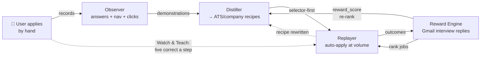
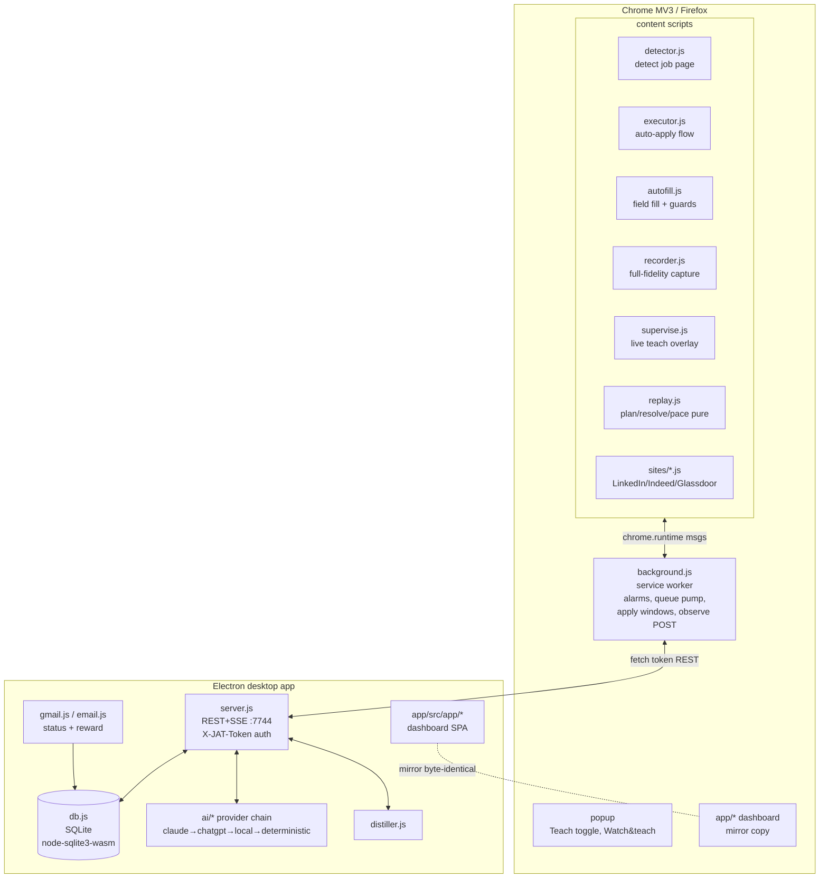
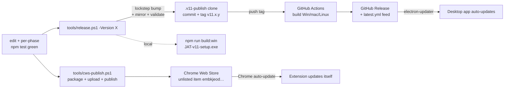

# JAT v11 — Master Reference (complete project context)

> The exhaustive, single-source-of-truth context for this project. Dense by design —
> meant to give a person or an AI the *entire* picture: what it is, how it's built, the
> data model, every phase we shipped, the deploy pipeline, the live results, and
> everything still open. For a short, visual version see **[OVERVIEW.md](OVERVIEW.md)**.
>
> Companion design docs (still accurate): [APPRENTICESHIP-ENGINE-DESIGN.md](APPRENTICESHIP-ENGINE-DESIGN.md),
> [TEACH-AND-CORRECT-DESIGN.md](TEACH-AND-CORRECT-DESIGN.md), [NEXT-ITERATION.md](NEXT-ITERATION.md),
> [TEACH-V1-BUGS.md](TEACH-V1-BUGS.md), [PUBLISHING.md](PUBLISHING.md).

---

## 1. What it is

**Job Application Tracker (JAT) v11** is a personal job-hunting automation system for one user (Pierre), with a second trial user (his Dad, telecom/cabling domain, on Firefox). Two pieces:

- **A Chrome/Firefox extension** (MV3) — content scripts that detect job postings, capture applications, auto-fill + auto-submit them, record the user's own manual applies, and let the user supervise/correct the engine live.
- **An Electron desktop companion app** — a local server (token-guarded REST + SSE on `127.0.0.1:7744`), a SQLite store (all data stays on the user's machine), the AI layer, the auto-apply queue/pacing engine, Gmail/IMAP status sync, and the dashboard UI.

The two talk over localhost; the app holds all data. As of **v11.19.1** the system reliably **auto-submits ~57–68% of attempted jobs** and **learns from the user** to get better.

### The core idea: an "Apprenticeship Engine"
JAT stopped being hand-coded form logic and became a system that **learns the user**: it watches them apply, distills that into reusable "recipes," replays them at volume, and grades itself on **interview replies**. The closed loop:

---

## 2. Architecture & runtime topology

**Key invariants**
- The app owns **all** data (SQLite under `%APPDATA%/jat11-app/jat.db`). The extension stores only a pairing token (`chrome.storage.local['jat11.token']`).
- Every REST route except `GET /health` and `POST /pair` requires `X-JAT-Token` (a stable per-install token in `kv.authToken`).
- The dashboard is **mirrored**: `extension/app/*` must be byte-identical to `app/src/app/*` (`tools/mirror.mjs --check` gates it; `extension/app` is the SOURCE).
- Cross-browser: no `chrome.tabGroups`/`storage.session` assumptions (Firefox lacks them) — all guarded; `storage.local` only.
- **Credential rail** (non-negotiable): passwords/payment/CVV/PIN/SSN/security-answers are NEVER stored as values, HTML, or screenshots — enforced at the DB write boundary (`SENSITIVE_RX` in `db.js`) AND client-side.

---

## 3. Data model (SQLite, all ids TEXT/uid, FK-cascade to profiles)

| Table | Purpose | Key columns |
|---|---|---|
| `jobs` | every captured/discovered posting | id, source, status, title, company, job_url, answers(JSON), fit_score, submitted_at |
| `auto_apply_tasks` | the apply queue | id, job_id, state (queued/scheduled/running/done/failed/skipped/parked/awaiting_*), mode, apply_route, attempts, last_error, transcript, park_reason, pending_questions, recipe_id |
| `profiles` | per-user profile (multi-profile capable) | id, name, is_default, source_assignments, data(JSON) |
| `qa` | learned Q→A memory (fuzzy-matched) | id, profile_id, question_norm, question, answer, seen_count, sources, **answer_lineage** (P1: JSON trail), **reward_score** |
| `profile_fields` | structured learned fields | id, profile_id, key_norm, label, value, confidence, locked, **reward_score**, last_validated_at |
| `emails` | Gmail/IMAP messages | id, matched_job_id, match_confidence, match_source(auto/suggested/manual/dismissed), category |
| `ats_recipes` | **the transfer unit** (P3) | id, profile_id, scope(ats/company), ats, company_key, confidence, reward_score, success_count, fail_count |
| `recipe_steps` | the replay program (P3 + T1 enrich) | recipe_id, step_index, action, label_pattern, field_type, strategy, advance_text, median_delay_ms, confidence, **selector, xpath, attrs, html, screenshot_id, source, default_value** |
| `nav_events` | human navigation log (P2) | profile_id, session_id, url_norm, host, ats, company_key, referrer_norm, kind(visit/handoff/...), rolling-capped 2000/profile |
| `application_outcomes` | the reward ledger (P6) | job_id, recipe_id, reward, reward_kind(email_reply/rejection/star/punish), email_id, credited(JSON) |
| `punishments` | user "never this job/company" (P7) | profile_id, kind(job/job_type/company), pattern, weight, decay_at (NULL=permanent, default 90d) |
| `demonstrations` | full-fidelity recorded clicks (T1) | profile_id, session_id, ats, company_key, action, label, selector, xpath, attrs, html, value(rail), screenshot_id, delay_ms, source(manual/teach/correction); prune-keep-3/key |
| `teach_screenshots` | form-crop PNGs (T1) | id, profile_id, path (file under userData/teach-shots/), w, h, bytes |
| `kv` | settings/state | authToken, settings, easyApplyLimitUntil, easyApplyObservedLimit, discoveryStatus, matchTraining, lastHealthyAt(ext) |

Migrations are versioned via `PRAGMA user_version` + an ordered `MIGRATIONS[]` in `db.js` (currently **v10**), each with a `backupNow('pre-vN')`.

---

## 4. What we shipped — full phase history

### v11.0–v11.15 (pre-engine, context)
Capture across boards, pipeline view, profiles, learned memory (`qa`/`profile_fields` per-profile), the auto-apply queue + pacing (gap÷concurrency), dedicated apply windows, the AI answer ladder, EEO/credential guards, Gmail status sync. Release pipeline: tag `v11.*` on `PierreSalama/Job-ext-app` (via the `.v11-publish` clone) → GitHub Actions builds Win/mac/Linux installers + publishes a release; the app auto-updates via electron-updater.

### v11.18.0 — The Apprenticeship Engine (P0–P9, 109 tests)
Built from a multi-agent design pass (see APPRENTICESHIP-ENGINE-DESIGN.md), grounded against real code.
- **P0** Credential safety rail (write-boundary) + v9 migration (ats_recipes, recipe_steps, nav_events, application_outcomes, punishments).
- **P1** Always-on Observer — harvest answers with `answer_lineage` (stamps 'manual'); queue-independent.
- **P2** `classifyAts(url)` + `recordNavEvent` (board→ATS handoff edges, rolling cap); background webNavigation taps.
- **P3** `distiller.js distillJob` + `resolveRecipe` (ATS recipe transfers to never-seen companies; company overlay wins).
- **P4** `ai/deterministic.js` no-model floor (works on Dad's GPU-less laptop, never fabricates/never a URL for years); hardware tiers = **Qwen for structured-JSON, Gemma for prose** (Pierre's call); `localsetup.js` first-run model provision + USB sidecar + checksum.
- **P5** `replay.js` (pure) + `executor.js attemptReplay` — strictly additive + gated, falls back on any divergence, never blind-submits.
- **P6** Gmail wired through `emailUpsert`+`matchEmailToJob` (sender-domain signal); confidence-weighted clamped credit (`reward*matchConfidence`, [-1,1]); rejection = fit-only; confirm-and-train inbox.
- **P7** punishments + `rankJob` (fit + reward − punish − geo − staleness) + truthful geo gate; queueNext/discovery consume it.
- **P8** cross-browser parity + the end-to-end loop test (interview reward measurably raised rankJob).
- **P9** released as v11.18.0.

### v11.19.0 — Teach & Correct (T0–T8, 151 tests)
From a collaborative design (TEACH-AND-CORRECT-DESIGN.md).
- **T0** Fixed live-apply bugs: search-bar "0" (shared `isSiteChromeInput` guard on every fill) + apply-window occlusion (side-placement + load-nudge).
- **T1** v10 schema: `demonstrations`, `teach_screenshots`, recipe_steps locator columns, prune-keep-N.
- **T2** `recorder.js` — full-fidelity capture (XPath+CSS+attrs+HTML+screenshot+value+timing); always-on + **Teach Mode** (popup + floating `● Teaching` pill + "captured ✓" toast).
- **T3** `distillDemonstrations` enriches recipes with real selectors; **selector-first replay** in `attemptReplay`.
- **T4** `supervise.js` — supervised **Step/Run**; on-page **"Fix this"** DevTools-style element-picker (or detected-list) that **authoritatively rewrites the recipe** (`recordRecipeCorrection` with a replacement, conf 0.95).
- **T5** "Taught Procedures" dashboard (view/edit/delete/reorder/flip; `/teach-shot/:id` path-confined) + "Watch & teach" button.
- **T6** LinkedIn Easy-Apply ~50/24h limit → detect → cooldown → **pivot to external jobs**.
- **T7** Glassdoor adapter + classifyAts; confirmed external-site learning is source-agnostic.
- **T8** cross-browser hardening + a validator check for the dynamic-import WAR trap + the teach→correct e2e.

### v11.19.1 — Teach & Correct live-bug fixes (T9, 163 tests)
From Pierre's first hands-on test (TEACH-V1-BUGS.md):
- **B1** popup stopped flipping to "Connect" on a transient health blip (`decideConnectionState` grace window, 401-only re-prompt, health timeout 1.2→2.5s).
- **B2** "Watch & teach" now supervises the **current tab** when it's a job page (`isJobPageUrl`), with a clear "open a job first" message instead of a silent revert.
- **B3** the floating Teach toggle appears on any job page the moment Teach Mode is on; idempotent vs a duplicate extension.
- **B4** broadened résumé file-input detection (`isResumeFileInput`) to catch styled "Upload resume" controls (Glassdoor / external sites).

---

## 5. The AI layer

Provider chain (`ai/provider.js`): `['claude','chatgpt','local']` for Pierre (cloud keys), with `ai/deterministic.js` as the floor under `local`. Per the locked decision: **Qwen/Llama for the structured-JSON answer path, Gemma for prose only.** `hardware.js` probes RAM/VRAM/GPU → a tier → `{structuredModel, proseModel}`. Local models run via Ollama today; bundling (all sizes offline + first-run tier download + USB sidecar + checksum) has its mechanism built but the **GGUF weight assets are not yet published** (see §8). The deterministic floor answers location/residency/education/years/relocation/auth from the profile so the engine still applies with zero AI.

---

## 6. Deploy & release pipeline (fully autonomous)

- **App:** `release.ps1` bumps the 3 versions in lockstep, mirrors, validates, syncs into `.v11-publish` (now `/XF`-excludes secrets), tags `v11.x.y`, pushes → CI builds + publishes the GitHub release; electron-updater pulls it. (CI "failure" conclusion is normal — only mac/Linux legs fail; Windows installer + feed publish fine.)
- **Extension:** `cws-publish.ps1` packages + uploads + publishes to the unlisted CWS item (id `embkjeodifedbklefocjjmflnkpnlekj`); Chrome auto-updates installs. **Autonomous** — one-time Google OAuth set up; creds in gitignored `tools/.cws-credentials.json`; an allow-rule in `~/.claude/settings.json` lets the assistant run the publish. **Standing rule: never ask the user to reload — always bump + publish.**
- **Repos:** source = `PierreSalama/Job-Board` (`main`); release = `PierreSalama/Job-ext-app` (`v11` + tags). Tagging Job-Board does NOT build.
- **Tests:** the canonical gate is `cd app && npm test` (163 tests as of v11.19.1) + `tools/validate-extension.mjs` (71 checks) + `tools/mirror.mjs --check` + `tools/validate-versions.mjs`. Each is wired into CI (`.github/workflows/release.yml`).

---

## 7. Live results (as of 2026-06-17)

- **Submit rate: ~57% over 60 min, ~68% over the tighter 30-min window** (21 submitted of ~31–37 attempted) — meeting the 60–70% target, on real LinkedIn submissions.
- Submitted jobs are predominantly LinkedIn Easy-Apply, `mode=auto`, `state=done`.
- The dominant historical losses (occlusion-hydration, search-bar mis-fill, stuck-on-Review radios) are fixed; remaining failures are mostly external/offsite + the throttled-window edge on a maximized monitor.

---

## 8. EVERYTHING LEFT TO DO (open items, clear + distinct)

### Known bugs / nits
1. **"Manual" vs "auto-assisted" mislabel** *(new, low)* — when the auto-task ends `skipped`/`failed` but the user finishes/assists it (touches the window, or steps in via Watch & teach), the submission is tagged **manual** (passive-capture path stamps `answer_lineage='manual'`). It's not wrong (they participated) but conflates "you helped an auto-apply" with "fully manual." Fix: add an "auto (assisted)" lineage/label distinct from pure manual.
2. **Maximized-window occlusion** *(known OS limit, med)* — if the user runs a fully-maximized window on a single monitor, the background apply tab is occluded → Chrome throttles it → slower/failed hydration. Mitigated by side-placement + the load-nudge; can't be fully beaten from inside the browser. Options: a stronger opt-in bring-to-front, or document the workaround (don't run fullscreen).
3. **Duplicate-extension churn** *(setup, user-resolved)* — running the unpacked dev copy AND the store copy races pairing/health + double-injects. The code now rides the blips; the real fix is removing the unpacked copy (use only the store one).
4. **CWS review latency** — each extension update passes Google review (same for unlisted); usually quick, occasionally delayed; broad `<all_urls>` + automation can draw scrutiny (fallbacks in PUBLISHING.md).

### Deferred features (designed, not built)
5. **GGUF local-model weights** *(P9 follow-on, med)* — the bundling MECHANISM (hardware-adaptive selection, first-run tier download, USB sidecar, checksum) exists; the actual per-tier Gemma/Qwen GGUF **assets are not published** yet. Degrades gracefully (cloud keys + deterministic floor). Needs: publish per-tier GGUF as release sidecar assets (each <2GB) + wire the download URLs.
6. **Replay-preview** *(T5 deferred, low)* — the dashboard "Taught Procedures" page lacks the live dry-run highlight (needs a content-script handshake); view/edit/delete/reorder/flip all work.
7. **Reward-loop "brain" depth** — the credit assignment is heuristic (confidence-weighted scoreboard). A contextual-bandit or periodic-LLM self-review layer was designed (APPRENTICESHIP doc) but not built.
8. **Step-level pacing realism** — `median_delay_ms` is now real (from demonstrations) where taught, default elsewhere; broader timing capture could improve the anti-detection floor.

### Backlog from NEXT-ITERATION.md still relevant
9. Make "manual" applies the user does outside the queue richer training data (mostly covered by the recorder now — verify).
10. Glassdoor markup is best-effort against class-hash selectors that rot — needs periodic selector refresh.
11. Indeed often hands off to `smartapply.indeed.com` (external) — the external/company-site replay path (recorder + selector-first) covers it, but live-validate.

### Bigger ambitions (from the design conversations, not yet scoped)
12. "Apply US-remote / everywhere" geo expansion — the gate exists (truthful work-authorization); broaden discovery scope by region, gated by eligibility.
13. The reward loop optimizing strictly for **interview replies** (Gmail) end-to-end at scale — the plumbing exists; needs real-world tuning of the lenient matcher thresholds + the confirm-prompt budget.

---

## 9. Operating runbook

- **Run the app:** install `app/dist/JAT-v11-setup.exe` (or it auto-updates). It serves `:7744` + the dashboard window.
- **The extension:** use the **store** copy (auto-updates); never reload. Pair via the popup if prompted.
- **Auto-apply:** dashboard → Automate → Auto-apply queue → configure boards (LinkedIn/Indeed/Glassdoor) + caps + Easy-Apply-only → start. It self-drives (discovery + pacing + retry-stale).
- **Teach Mode:** popup or the floating `○ Teach` pill on a job page → apply by hand → it captures (toast per step).
- **Watch & teach:** popup → Start → supervised run on the current job; **Fix this** → click the right element → recipe rewritten live.
- **Review:** dashboard → Automate → ❖ Taught Procedures (edit/delete/reorder/flip learned steps).
- **Diagnose:** copy `jat.db`(+`-wal`/`-shm`) → query via `node-sqlite3-wasm`; logs at `%APPDATA%/jat11-app/logs/main.log`.
- **Ship a change:** `npm test` (from app/) → `tools/release.ps1 -Version 11.x.y -Message …` (app) → `tools/cws-publish.ps1 -Target default` (extension). Commit to Job-Board.

---

## 10. File map (where things live)

- **Extension** `extension/`: `manifest.json`, `background.js` (SW), `lib/{api,jobpage}.js`, `popup/*`, `app/*` (mirrored dashboard), `content/{detector,executor,autofill,recorder,supervise,replay,discover,detector}.js`, `content/sites/{linkedin,indeed,glassdoor,...}.js`, `content/signals/*`, `content/lib/*`.
- **App** `app/src/`: `main.js` (Electron + intervals), `server.js` (REST/SSE), `db.js` (schema + all data fns), `distiller.js`, `hardware.js`, `localsetup.js`, `fit.js`, `ai/{provider,ollama,deterministic,prompts,extract}.js`, `gmail.js`, `email.js`, `app/*` (dashboard SPA — mirror source is `extension/app`).
- **Tooling** `tools/`: `release.ps1`, `cws-publish.ps1`, `cws-get-token.mjs`, `mirror.mjs`, `validate-extension.mjs`, `validate-versions.mjs`.
- **Tests** `tests/*.test.mjs` (163) — run from `app/` via `npm test`.
- **Docs** `docs/`: this file + the design/backlog docs listed at the top.
