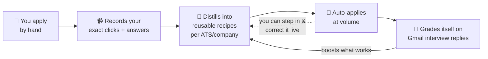
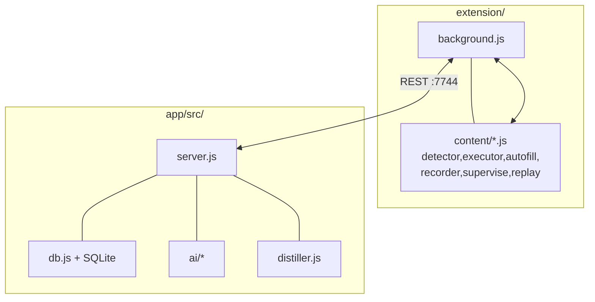

# JAT v11 — Overview (for devs & new teammates)

A fast, visual orientation. For the full deep-dive see **[MASTER-REFERENCE.md](MASTER-REFERENCE.md)**.

---

## What it is, in one breath
**A personal job-application autopilot.** A Chrome/Firefox **extension** finds job postings and auto-fills + auto-submits applications; an Electron **desktop app** holds all your data locally, runs the AI, paces the auto-apply queue, and learns. It **watches you apply, learns to do it itself, and grades itself on interview replies.** Today it auto-submits **~57–68% of attempted jobs**.

---

## The big idea — it learns *you*

Apply at one Workday company → it now knows **every** Workday company. Correct a wrong field once → it never gets it wrong again.

---

## Two parts

| Extension (browser) | Desktop app (Electron) |
|---|---|
| detect job pages, capture applies | local SQLite store (your data stays on your machine) |
| auto-fill + auto-submit | token-guarded REST/SSE API on `:7744` |
| **record** your manual applies (full fidelity) | AI layer (cloud keys → local model → deterministic floor) |
| **Teach Mode** + **Watch & Teach** live correction | auto-apply queue + pacing + retry |
| popup + dashboard UI | Gmail/IMAP status + reward sync; the dashboard SPA |

They talk over localhost. **All data is local — nothing goes to a server.**

---

## What it can do (feature checklist)
- ✅ Auto-discover + auto-apply (LinkedIn, Indeed, **Glassdoor**, + external company career sites / Workday/Greenhouse/Lever/iCIMS/…)
- ✅ **Learns recipes** keyed by ATS *and* company; transfers across companies
- ✅ **Selector-first replay** — targets the exact element you taught, not a label guess
- ✅ **Teach Mode** — records your real clicks (XPath/CSS/HTML/screenshot/timing), credential-safe
- ✅ **Watch & Teach** — supervised run; **"Fix this"** picks the right element and rewrites the recipe on the spot
- ✅ **Taught Procedures** dashboard — review/edit/delete/reorder everything it learned
- ✅ **Reward loop** — matches Gmail interview replies back to applications; floats up companies that reply
- ✅ **Punish** a job / job-type / whole company; truthful geo gate
- ✅ **Easy-Apply limit pivot** — hits LinkedIn's ~50/day cap → keeps working external jobs
- ✅ Local AI floor so it still applies with **zero AI** (Dad's GPU-less laptop)
- ✅ Cross-browser (Chrome + Firefox); credential/payment fields **never** stored

---

## How to get oriented (for a dev)

- **Start reading at** `app/src/db.js` (the whole data model + every data function) and `app/src/server.js` (the API).
- **The engine** lives in `extension/content/executor.js` (auto-apply) + `replay.js` (pure decision logic) + `recorder.js` (capture) + `supervise.js` (live correct).
- **Tests:** `cd app && npm test` (163 tests, all green). Plus `tools/validate-extension.mjs`, `tools/mirror.mjs --check`, `tools/validate-versions.mjs`.
- **Ship:** `tools/release.ps1 -Version 11.x.y` (app → CI) + `tools/cws-publish.ps1` (extension → Chrome Web Store). Fully automated.

---

## Where it's at + what's next

**State:** v11.19.1, live and working — ~57–68% auto-submit, learning loop closed, published to the Chrome Web Store + GitHub releases.

**Top things still open** (full list in MASTER-REFERENCE §8):
1. Publish the local-model **GGUF weight assets** (mechanism built; weights not uploaded)
2. Tighten the **"manual vs auto-assisted"** label (a job you help finish is tagged "manual")
3. **Maximized-window** occlusion throttle (OS limit; mitigated, not beaten)
4. Replay-preview highlight in the review dashboard (deferred)
5. Deeper reward "brain" (bandit / periodic LLM self-review) + interview-reply tuning at scale

---

## Glossary
- **ATS** — Applicant Tracking System (Workday, Greenhouse, Lever, iCIMS…). Recipes key off these so one apply teaches many companies.
- **Recipe** — the learned step-by-step program to fill + submit a form on a given ATS/company.
- **Demonstration** — one recorded interaction (a click/fill) with its exact locator + screenshot + timing.
- **Lineage** — how an answer was learned (manual / teach / correction / ai / deterministic).
- **Reward** — signal that an application worked: an interview reply (strong), a submit (weak), a rejection (mild-negative on fit), a user star/punish.
